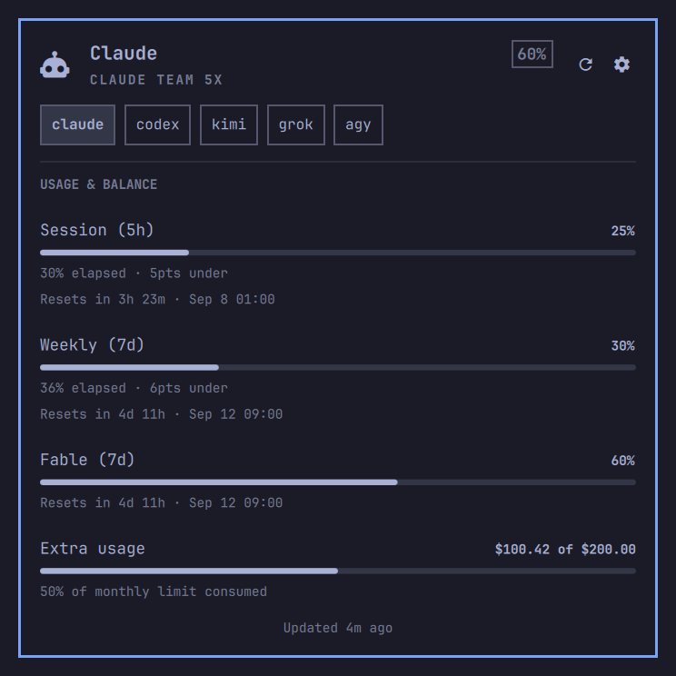

# ai-usagebar

Public Omarchy-focused fork of
[akitaonrails/ai-usagebar](https://github.com/akitaonrails/ai-usagebar).
Native Quattro panel and tabbed TUI for AI plan usage across **Claude**,
**Codex/ChatGPT**, **GitHub Copilot**, **Z.AI (GLM)**, **OpenRouter**,
**DeepSeek**, **Kimi**, **Nous Research**, **OpenCode Go**, **Command Code**,
and other supported AI coding services.

This fork keeps every provider in the Rust crate. It does **not** ship GNOME,
KDE, macOS, or Nix frontends, and it does not document Waybar. The
`ai-usagebar` binary can still print Waybar JSON when stdout is not a TTY;
that path is leftover CLI behavior, not a supported frontend here. See
[FORK.md](FORK.md) for how to pull upstream.

<p align="center">
  
</p>

## Features

- Native Omarchy Quattro plugin: keyboard navigation, provider switching, live
  reset timers, stale/error states, theme-aware UI.
- `ai-usagebar-tui` with a compact provider overview; refreshes every 60s.
- Optional Claude Code context view for recent local session usage.
- One bar item cycles through enabled providers. `[ui] primary` sets the
  default in the widget and TUI.
- Atomic caches and file locking so overlapping refreshes do not double-fetch.
- Network failures keep the previous data visible; HTTP errors show in the
  panel.

## Reference guides

- [Configuration](docs/configuration.md)
- [Claude accounts](docs/claude-accounts.md)
- [Format placeholders](docs/format-placeholders.md)
- [Provider endpoints and live tests](docs/vendor-endpoints.md)
- [Omarchy plugin](omarchy/README.md)

## Install

The plugin is a display frontend and does not bundle the `ai-usagebar`
executable. Install the binary first, then this repo as the plugin:

```bash
omarchy pkg aur add ai-usagebar-bin
omarchy plugin add https://github.com/bradflaugher/ai-usagebar.git --enable
```

Disable Quattro's stock Agents widget if you want AI Usage to be the only
agent status item:

```bash
omarchy plugin disable omarchy.agents
```

**Left-click** opens the native panel. **Gear** or `s` opens QML settings.
**Right-click** opens `ai-usagebar-tui`. Middle-click or the mouse wheel
switches providers.

Update or remove:

```bash
omarchy plugin update bradflaugher.ai-usagebar
omarchy plugin remove bradflaugher.ai-usagebar
```

### From source

When you change the Rust crate, skip AUR and install the binaries from this
tree:

```bash
cargo build --release
make install PREFIX=$HOME/.local
```

## Authentication

Claude and Codex reuse OAuth credentials from their official CLIs. Other
providers use API keys, an existing app login, or a local service. API keys can
come from environment variables or `config.toml`.

| Vendor | Method | Action required |
|---|---|---|
| Claude | OAuth from `~/.claude/.credentials.json` | Run `claude` once. Tokens refresh automatically. |
| Anthropic API | Organization Admin key | Opt in with `ANTHROPIC_ADMIN_KEY` or `[anthropic_api] api_key`. Inference and Claude Code keys do not work. |
| Codex | OAuth from `~/.codex/auth.json` | Run `codex login` once. Token auto-refreshes. |
| GitHub Copilot | GitHub CLI OAuth | Run `gh auth login --web`, then choose GitHub Copilot as the primary provider in Settings. |
| Z.AI | API key (`ZAI_API_KEY` or `[zai] api_key`) | Set either. |
| OpenRouter | API key (`OPENROUTER_API_KEY` or config) | Set either. Named keys are supported. |
| DeepSeek | API key | Set either and opt in. |
| Kimi | Kimi Code CLI login **or** API key | Opt in, then log in with `kimi` or set a key. |
| Kilo | API key | Opt in. For a team balance, also set `[kilo] organization_id`. |
| Novita | API key | Opt in. |
| Moonshot | API key | Opt in. Region `cn` for CNY; `global` uses USD. |
| Grok (xAI) | Management key | Opt in with `XAI_MANAGEMENT_KEY`. An inference key does not work. |
| SuperGrok | Existing `grok login` | Opt in, install Grok Build, and run `grok login`. Subscription usage, not the Management API balance. |
| MiniMax | Token Plan subscription key | Opt in. Pay-as-you-go keys do not work. |
| Google Antigravity | Local Antigravity server | Opt in and keep Antigravity or an interactive `agy` session running. |
| Cursor | Cursor IDE or `cursor-agent` login | Opt in and sign in once. |
| Kiro CLI | Existing kiro-cli login | Opt in and run `kiro-cli login` once. |
| Nous Research | OAuth device flow | Enable `[nous]`, then log in from the Omarchy settings panel or `ai-usagebar auth nous login`. |
| OpenCode Go | API key | Enable `[opencode-go]`, then enter the key in settings or set the env var. |
| Command Code | Existing `commandcode` or pi login | Enable `[commandcode]` and sign in once. |

`enabled = true` is what makes a vendor fetch. Claude, Codex, Kimi,
SuperGrok, and Antigravity default to on; everything else is opt-in. Saving a
non-empty API key in Settings also sets that vendor's `enabled = true`.

Vendors that authenticate through a local login rather than a key — Cursor,
Kiro, SuperGrok, Antigravity, Command Code, and Kimi with a CLI login — have
no key field. Enable them in `config.toml`.

Inline keys belong in `~/.config/ai-usagebar/config.toml` at mode `600`.
Claude, Codex, SuperGrok, Cursor, and kiro-cli credentials stay in the files
those tools already own; this crate reads them and does not write them back.

## Configuration

`~/.config/ai-usagebar/config.toml` is optional. A minimal example that only
fetches Claude, Codex, Kimi, Antigravity, and SuperGrok:

```toml
[ui]
primary = "anthropic"
overview_vendors = ["anthropic", "openai", "kimi", "antigravity", "supergrok"]

[anthropic]
enabled = true

[openai]
enabled = true

[kimi]
enabled = true

[zai]
enabled = false

[openrouter]
enabled = false

[antigravity]
enabled = true

[supergrok]
enabled = true
```

See the [configuration reference](docs/configuration.md) for every provider,
display option, account path, region, and API-key setting.

## Quick start

```bash
ai-usagebar                        # uses [ui] primary (defaults to anthropic)
ai-usagebar --vendor openai
ai-usagebar --vendor antigravity
ai-usagebar --vendor supergrok
ai-usagebar --json                 # force JSON
ai-usagebar usage                  # every configured vendor
ai-usagebar-tui
```

## Omarchy panel

The widget reads providers already enabled in `config.toml`. It does not keep
another copy of API keys.

- Left-click opens the native panel.
- Gear or `s` opens QML settings.
- Right-click launches the TUI.
- Middle-click or the mouse wheel switches providers.
- The selected provider is remembered across shell reloads. If it is later
  disabled, the configured primary is used instead.

The [Omarchy plugin guide](omarchy/README.md) covers keyboard controls,
credential handling, and `omarchy bar set` display options.

## Hyprland: float the TUI

Right-click launches `ai-usagebar-tui`. To float it like Omarchy's other
settings TUIs, add this to `~/.config/hypr/hyprland.lua` (or a required
module) using Omarchy's `o.window` helper, then `hyprctl reload`.

Current Hyprland `windowrule` form, if you prefer a `.conf`:

```ini
windowrule = float on, match:class ^(org\.omarchy\.ai-usagebar-tui)$
windowrule = center on, match:class ^(org\.omarchy\.ai-usagebar-tui)$
windowrule = size 875 600, match:class ^(org\.omarchy\.ai-usagebar-tui)$
```

## TUI

```bash
ai-usagebar-tui
```

- `Tab` / `l` / `→` — next tab
- `Shift+Tab` / `h` / `←` — previous tab
- `r` — refresh active tab
- `R` — refresh all tabs
- `s` — Settings overlay
- `c` — local Claude context (when `[context] enabled = true`)
- `q` / `Esc` / `Ctrl-C` — quit


## Local development

```bash
make test
make clippy
omarchy plugin validate .
node omarchy/model.test.mjs
```

After merging upstream:

```bash
git fetch upstream
git merge upstream/main
./scripts/strip-platforms.sh
```

## Theming

Auto-merges with the active Omarchy theme at
`~/.config/omarchy/current/theme/colors.toml`.

## Releases

Release history lives on GitHub Releases, generated from commits between tags.

## Acknowledgements

This is a fork of [akitaonrails/ai-usagebar](https://github.com/akitaonrails/ai-usagebar).
The Codex and Claude OAuth endpoint references came from
[`claudebar`](https://github.com/mryll/claudebar) and
[`codexbar`](https://github.com/mryll/codexbar), both by mryll.

## License

MIT.
